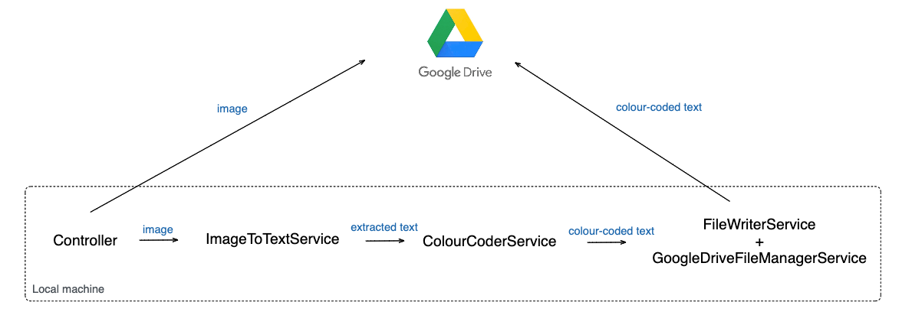

## Image Analyzer
This is an image analyzer that allows users to upload an image to Google Drive and to extract the text in the image in 2 language options: Simplified Chinese and English. For English text, the words containing letter "o" will be coloured blue. Both the image and the extracted text would be available in a Google Drive folder https://drive.google.com/file/d/1wrRMDckYSUgmHH7_iVRaUsIVrmwlcp6p/view?usp=share_link

## Demo
### English
https://user-images.githubusercontent.com/52971362/216832443-117cd074-93d5-43d0-8bbc-3b6a182c8b9e.mov

### Chinese
https://user-images.githubusercontent.com/52971362/216832438-0d3444b5-6b2d-47cb-b87f-424a4f824a8a.mov

## Image Analyzer using the following stacks
- Java 17, Spring Boot 3.0.2
- Gradle for the build tool
- Spring Web MVC for web layer
- Google Drive folder for database
- Thymeleaf for the template engine
- HTML 5 and Bootstrap 4 for responsive user interface

## Code design
### English 

### Chinese

## How to run the code
- Download IntelliJ IDEA https://www.jetbrains.com/idea/download/ 
- Install Java version 17 (see build.gradle file for Java configuration) https://docs.aws.amazon.com/corretto/latest/corretto-17-ug/downloads-list.html
- Set up your GDrive token and credentials by following this https://developers.google.com/drive/api/quickstart/java (You should have 2 files ``src/main/resources/credentials.json`` and ``tokens/StoredCredential`` in the end. The ``tokens/StoredCredential`` will be automatically generated when you try to access the GDrive for the first time and you might need to manually verify via link)
- Run the main Spring Boot app by clicking the green triangle next to the class ``ImageAnalyzerApplication``

## Further improvements
- If you want to detect text language other than English and Simplified Chinese, you need to add the trained data into ``resources/tessdata/`` from the following repository https://github.com/tesseract-ocr/tessdata
- The text detection engine can be improved by tuning 2 parameters: page segmentation mode and OCR engine mode https://www.baeldung.com/java-ocr-tesseract#tess4j
- After the text detection engine is well-tuned, we can add unit test to ensure that the detected text is as expected
